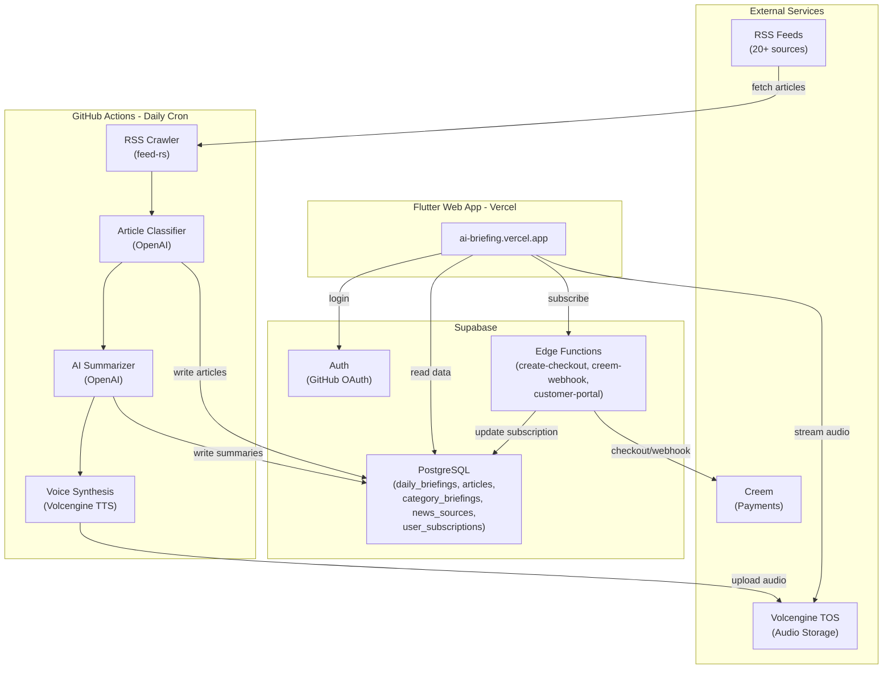

# AI Briefing

Daily AI news briefing app with voice broadcast support. Automatically crawls AI news from RSS feeds, generates summaries using OpenAI, and produces audio briefings.

**Live**: [ai-briefing.vercel.app](https://ai-briefing.vercel.app/)

## Architecture



## Features

- Daily AI news aggregation from 20+ RSS sources
- AI-powered summary generation with category classification (LLM, Agent, Coding, Infra, etc.)
- Voice broadcast with high-quality TTS (Volcengine)

## Tech Stack

| Layer | Technology | Purpose |
|-------|-----------|---------|
| Frontend | Flutter (Dart) | Web app on Vercel |
| Backend | Rust | Daily cron job (GitHub Actions) |
| Database | Supabase (PostgreSQL) | Data storage, Auth, Edge Functions |
| AI Summary | OpenAI API | News summarization and classification |
| TTS | Volcengine TTS | Audio generation |
| Storage | Volcengine TOS | Audio file hosting |
| Payments | Creem | Subscription billing |
| CI/CD | GitHub Actions + Vercel | Automated deployment |

## News Sources

| Source | URL |
|--------|-----|
| TechCrunch AI | `https://techcrunch.com/category/artificial-intelligence/feed/` |
| The Verge AI | `https://www.theverge.com/ai-artificial-intelligence/rss/index.xml` |
| VentureBeat AI | `https://venturebeat.com/category/ai/feed/` |
| AI News | `https://www.artificialintelligence-news.com/feed/` |
| Hacker News AI | `https://hnrss.org/newest?q=AI+OR+LLM+OR+GPT` |
| OpenAI Blog | `https://openai.com/blog/rss.xml` |
| Hugging Face Blog | `https://huggingface.co/blog/feed.xml` |
| vLLM Blog | `https://blog.vllm.ai/feed.xml` |
| Google AI Blog | `https://blog.google/technology/ai/rss/` |
| LMSYS Org | `https://lmsys.org/rss.xml` |
| LangChain Blog | `https://blog.langchain.dev/rss/` |
| NVIDIA Blog | `https://blogs.nvidia.com/feed/` |
| CNCF Blog | `https://www.cncf.io/blog/feed/` |
| Kubernetes Blog | `https://kubernetes.io/feed.xml` |
| Ars Technica | `https://feeds.arstechnica.com/arstechnica/technology-lab` |
| MIT Tech Review AI | `https://www.technologyreview.com/topic/artificial-intelligence/feed` |
| 机器之心 | `https://www.jiqizhixin.com/rss` |
| 量子位 | `https://www.qbitai.com/feed` |

News sources are stored in the `news_sources` table and can be managed via Supabase.

## Local Development

### Prerequisites

- Flutter SDK (3.x)
- Rust toolchain (for backend)
- Supabase CLI (for Edge Functions)
- A Supabase project with migrations applied

### Flutter Web App

```bash
cd app
cp .env.example .env
# Edit .env with your SUPABASE_URL and SUPABASE_PUBLISHABLE_KEY

flutter pub get
flutter run -d chrome --web-port=3000
```

> Add `http://localhost:3000` to Supabase Dashboard -> Auth -> URL Configuration -> Redirect URLs for OAuth to work locally.

### Rust Backend

```bash
cd backend
cp env.example .env
# Edit .env with your credentials (database, OpenAI, Volcengine TTS/TOS)

# Run once immediately
cargo run --release -- --run-now

# Run with scheduler
cargo run --release
```

### Supabase Edge Functions

```bash
# Serve locally
supabase functions serve --env-file supabase/.env.local

# Deploy
supabase functions deploy create-checkout --no-verify-jwt
supabase functions deploy creem-webhook --no-verify-jwt
supabase functions deploy customer-portal --no-verify-jwt
```

### Database Migrations

Run SQL files in `supabase/migrations/` in order via Supabase SQL Editor, or use:

```bash
supabase db push
```

## Project Structure

```
ai-briefing/
├── backend/               # Rust backend (cron job)
│   └── src/
│       ├── crawler/       # RSS feed crawler
│       ├── summarizer/    # OpenAI summary + classifier
│       ├── tts/           # Volcengine TTS
│       ├── storage/       # Volcengine TOS upload
│       ├── db/            # Database repository
│       ├── entity/        # SeaORM entities
│       └── jobs/          # Daily job orchestration
├── app/                   # Flutter web app
│   └── lib/
│       ├── models/        # Data models
│       ├── providers/     # Riverpod providers
│       ├── screens/       # UI screens
│       ├── services/      # Supabase services
│       ├── widgets/       # Reusable widgets
│       └── theme/         # App theme
├── supabase/
│   ├── functions/         # Edge Functions (Creem payments)
│   └── migrations/        # SQL migrations
└── .github/workflows/     # CI/CD
```

